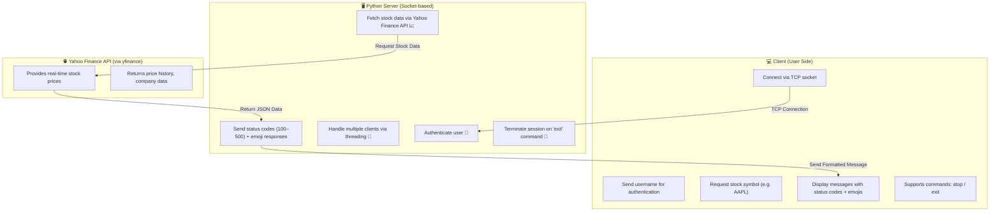

# StockTrack

# 📈 Stock Tracker System (Client–Server with Yahoo Finance API)

This project was created by **Yosakorn Sirisoot**

## 🧭 Overview

This project implements a **real-time stock tracking system** using a **Python socket-based client–server architecture**.  
It connects multiple clients to a single server, which retrieves **live stock prices** via the **Yahoo Finance API** using the `yfinance` library.

---

## 🎯 Objectives

- Enable authenticated users to request **live stock data**.
- Allow **real-time updates** for multiple clients simultaneously.
- Provide clear **status codes** and **emoji responses** for better user interaction.
- Support **logout** and **session termination** upon user exit.

---

## ⚙️ System Components

| Component                | Description                                                                                                     |
| ------------------------ | --------------------------------------------------------------------------------------------------------------- |
| 💻 **Client**            | Sends user credentials and stock requests to the server, receives formatted live data, and displays it.         |
| 🖥️ **Server**            | Authenticates users, fetches live stock prices from the Yahoo Finance API, and sends updates with status codes. |
| 🌐 **Yahoo Finance API** | Provides real-time and historical market data through the `yfinance` Python library.                            |

---

## 🚀 Features Summary

| Feature                      | Description                                                                  |
| ---------------------------- | ---------------------------------------------------------------------------- |
| 🔐 **User Authentication**   | Server verifies username before granting access.                             |
| 📊 **Live Stock Prices**     | Retrieves current stock prices directly from Yahoo Finance API (`yfinance`). |
| 💬 **Status Codes + Emojis** | Communicates results clearly using numeric codes and emoji icons.            |
| 👥 **Multi-Client Support**  | Each connected client runs on a separate server thread.                      |
| ⏱️ **Auto Update**           | Fetches updated stock prices every few seconds.                              |
| 🛑 **Logout & Exit**         | Clients can log out or terminate sessions safely.                            |

---

## 🧾 Status Code Reference

| Code           | Meaning         | Example                                 |
| -------------- | --------------- | --------------------------------------- |
| 100            | CONTINUE        | Request received and processing started |
| 200            | OK              | Successful operation                    |
| 200 (logout)   | OK (Logout)     | Successful logout                       |
| 400            | BAD_REQUEST     | Invalid or malformed command            |
| 401            | UNAUTHORIZED    | Invalid username                        |
| 404            | NOT_FOUND       | Stock ticker not found                  |
| 500            | SERVER_ERROR    | Server exception occurred               |
| 500 (shutdown) | SERVER_SHUTDOWN | Server is stopping                      |

---

## 🔄 How It Works

### 🧩 Step-by-Step Flow

1. **Client connects** to the server via TCP socket.
2. **User authentication** — the server validates the username.
3. **Client sends stock request** — e.g., `AAPL`, `TSLA`.
4. **Server fetches data** from Yahoo Finance API using `yfinance`.
5. **Server responds** with stock prices and status codes:
6. **Client displays** prices live and updates periodically.
7. User can type:

- `"stop"` → stop live updates
- `"exit"` → terminate session

---

## 🧠 Architecture Diagram



## 🧩 Requirements

### 🧱 Dependencies

Before running the project, make sure you have the following installed:

```bash
pip install yfinance
pip install feedparser
```

### 🐍 Python Version

- Python 3.9 or higher is required.
>>>>>>> be78238 (inital commit)
