# StockTrack

# 📈 Stock Tracker System (Client–Server with Yahoo Finance and feedparser)

This project was created by **Yosakorn Sirisoot**

## 🧭 Overview

This project implements a **real-time stock tracking system** using a **Python socket-based client–server architecture**.  
It connects multiple clients to a single server, which retrieves **live stock prices** via the **Yahoo Finance API** using the `yfinance` library.

---

## 🎯 Objectives

- Enable authenticated users to request **live stock data**.
- Allow **real-time updates** for multiple clients simultaneously.
- Provide clear **status codes** and **emoji responses** for better user interaction.
- Support **logout** and **session termination** upon user exit.

---

## ⚙️ System Components

| Component                | Description                                                                                                     |
| ------------------------ | --------------------------------------------------------------------------------------------------------------- |
| 💻 **Client**            | Sends user credentials and stock requests to the server, receives formatted live data, and displays it.         |
| 🖥️ **Server**            | Authenticates users, fetches live stock prices from the Yahoo Finance API, and sends updates with status codes. |
| 🌐 **Yahoo Finance API** | Provides real-time and historical market data through the `yfinance` Python library.                            |
| 🌐 **feedparser**        | Parses RSS feeds to retrieve the latest market news.                                                            |

---

## 🚀 Features Summary

| Feature                    | Description                                                                  |
| -------------------------- | ---------------------------------------------------------------------------- |
| 🔐 **User Authentication** | Server verifies username before granting access.                             |
| 📊 **Live Stock Prices**   | Retrieves current stock prices directly from Yahoo Finance API (`yfinance`). |
| 📰 **Market News**         | Retrieves global market news directly from feedparser (`feedparser`).        |

<<<<<<< HEAD
|🏢 **Company Info** | Retrieve company information directly from Yahoo Finance API (`yfinance`). |
| 💵 **Dividend Info** | Retrieve dividend information directly from Yahoo Finance API (`yfinance`). |
=======
| 📰 **Market News** | Retrieves global market news directly from feedparser (`feedparser`). |
| 🏢 **Company Info** | Retrieve company information directly from Yahoo Finance API (`yfinance`). |
| 💵 **Dividend Info** | Retrieve dividend information directly from Yahoo Finance API (`yfinance`). |

---

## 🧾 Status Code Reference

| Code           | Meaning         | Example                                 |
| -------------- | --------------- | --------------------------------------- |
| 100            | CONTINUE        | Request received and processing started |
| 200            | OK              | Successful operation                    |
| 200 (logout)   | OK (Logout)     | Successful logout                       |
| 400            | BAD_REQUEST     | Invalid or malformed command            |
| 401            | UNAUTHORIZED    | Invalid username                        |
| 404            | NOT_FOUND       | Stock ticker not found                  |
| 500            | SERVER_ERROR    | Server exception occurred               |
| 500 (shutdown) | SERVER_SHUTDOWN | Server is stopping                      |

---

## 🔄 How It Works

1. Start the server

```
python server.py
```

2. Start the client

```
python client.py
```

1. Start the server

```
python server.py
```

2. Start the client

```
python client.py
```

### 🧩 Step-by-Step Flow

1. **Client connects** to the server via TCP socket.
2. **User authentication** — the server validates the username.
3. **Client sends stock request** — e.g., `AAPL`, `TSLA`.
4. **Server fetches data** from Yahoo Finance API using `yfinance`.
5. **Server responds** with stock prices and status codes:
6. **Client displays** prices live and updates periodically.
7. User can type:

- `"stop"` → stop live updates
- `"exit"` → terminate session

---

## 🧠 Architecture Diagram

```mermaid
flowchart TD
 subgraph Client["💻 Client (User Side)"]
     C1["Connect via TCP socket"]
     C2["Send username for authentication"]
     C3["Request stock symbol (e.g. AAPL)"]
     C4["Display messages with status codes + emojis"]
     C5["Supports commands: stop / exit"]
 end

 subgraph Server["🖥️ Python Server (Socket-based)"]
     S1["Authenticate user 👤"]
     S2["Handle multiple clients via threading 🔁"]
     S3["Fetch stock data via Yahoo Finance API 📈"]
     S4["Send status codes (100–500) + emoji responses"]
     S5["Terminate session on 'exit' command 🛑"]
 end

 subgraph API["🌐 Yahoo Finance API (via yfinance)"]
     A1["Provides real-time stock prices"]
     A2["Returns price history, company data"]
 end

 C1 -->|TCP Connection| S1
 S3 -->|Request Stock Data| A1
 A1 -->|Return JSON Data| S4
 S4 -->|Send Formatted Message| C4
```



## 🧩 Requirements

### 🧱 Dependencies

Before running the project, make sure you have the following installed:

```bash
pip install yfinance
pip install feedparser
```

### 🐍 Python Version

- Python 3.9 or higher is required.
  > > > > > > > be78238 (inital commit)
